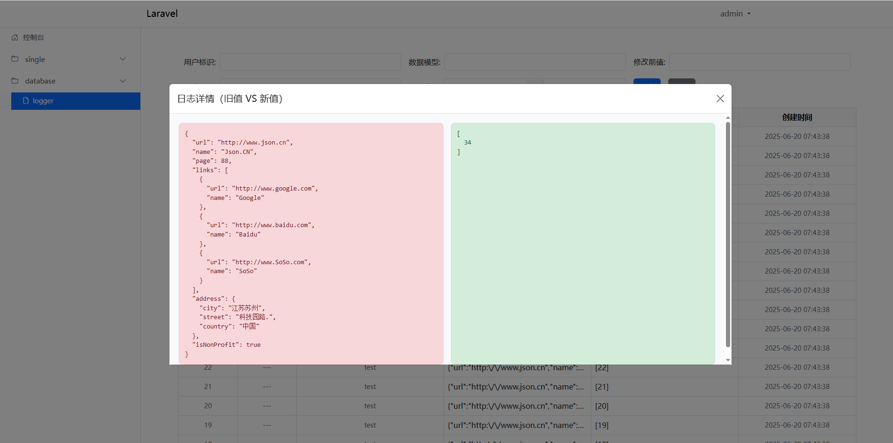

# Laravel-Logger 🔐

Laravel-Logger 文件日志和数据库日志扩展包。

## 📦 安装

```bash
composer require layman/laravel-logger
```

## ⚙️ 发布配置

```bash
php artisan vendor:publish --provider="Layman\LaravelLogger\LoggerServiceProvider" --tag=logger

// SESSION_DRIVER=database 执行
php artisan make:session-table

php artisan migrate

php artisan db:seed --class="Layman\\LaravelLogger\\Database\\Seeders\\LoggerUserSeeder"
```

## 🚀 使用
```php
use Illuminate\Database\Eloquent\Model;
use Illuminate\Support\Facades\Event;
use Illuminate\Support\ServiceProvider;
use Illuminate\Support\Str;
use Layman\LaravelLogger\Facades\Logger;

// 数据库日志使用方式
Event::listen('eloquent.created: *', function ($event, array $data) {
    $model = $data[0];
    // 建议排除日志写入操作
    if ($model instanceof \Layman\LaravelLogger\Models\Logger) {
        return;
    }
    $type = Str::between($event, 'eloquent.', ':');
    // 必须使用withoutEvents 在回调函数执行期间，临时禁用 Eloquent 模型事件（created、updated、deleted 等），防止事件被触发。
    Model::withoutEvents(function () use ($model, $type) {
        Logger::setUserid(11)
            ->setType($type)
            ->setModel(get_class($model))
            ->setOld([])
            ->setNew($model->getAttributes())
            ->create();
    });
});
```

访问地址：`http://your-domain.com/logger/login`




## 免责声明

- 扩展包作者不对本工具的安全性、完整性、可靠性、有效性、正确性或适用性做任何明示或暗示的保证，也不对本扩展包的使用造成的任何直接或间接的损失、责任、索赔、要求或诉讼承担任何责任。
- 扩展包作者保留随时修改、更新、删除权利，无需事先通知或承担任何义务。
- 使用者在下载、安装、运行或使用本扩展包时，即表示已阅读并同意本免责声明。如有异议，请立即停止使用本扩展包，并删除所有相关文件。

## 🙌 支持与贡献

欢迎提 Issue 或 PR 来改进此包。你的每一个建议和贡献，都是我们前进的动力！

如果你觉得 Laravel-Journal 有帮助，别忘了点个 ⭐ Star 哦！

